

  

KRUSH is an android native application where students can book tutoring session based on the tutor's hourly rate, availability, and overall rating. Students can record their tutoring sessions and revisit their previous conversations. Tutors can also build their own profile and reputation through KRUSH. All payment transactions are taken care of by the application making it easy and simple to book a new tutor. 

## Table Of Contents
- Application Screenshots
- KRUSH Database
  - ER Diagram
- Site Map
- UML Diagram
- Code Contribution Instructions
  - Setup Development Environment
  - Virtual Device Testing
  - DB Migrations and Seeding
  - DB Reset
- 3rd Party References

## KRUSH Database 
KRUSH uses SQLite along with Android's DBHelper Class for data storage / retrieval.

### ER Diagram
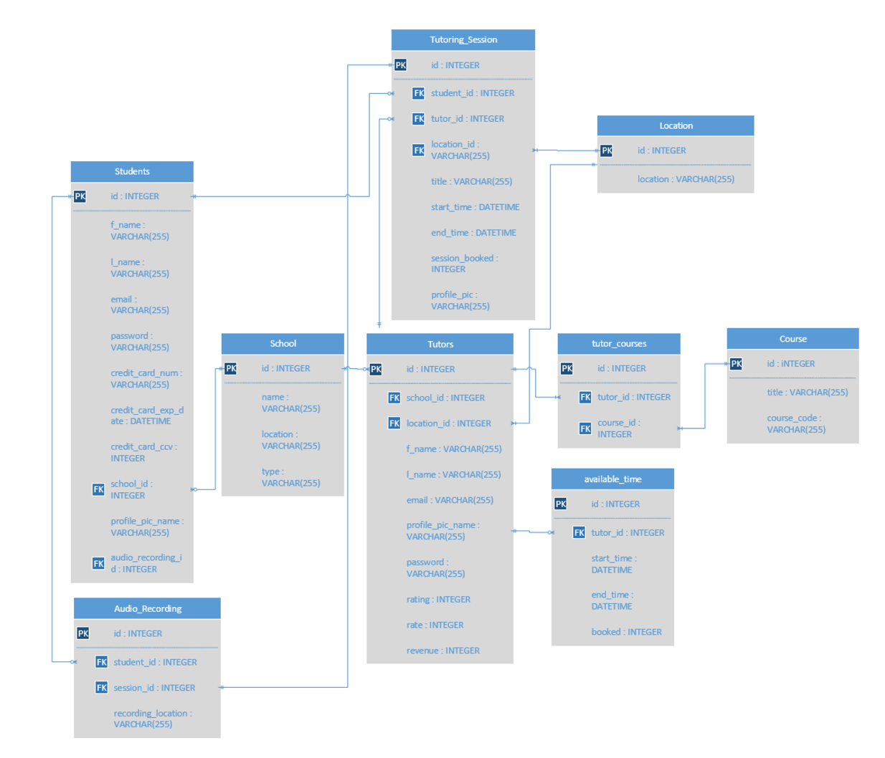

## Site Map
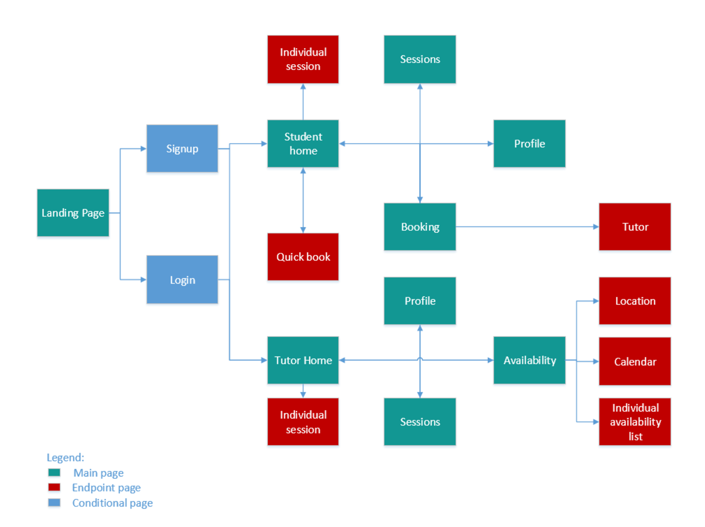

## UML Diagram
[Click here](https://drive.google.com/open?id=0B_oCfPfOVbvWUV9GdHV5SXNPV1k) to take a look at KRUSH's UML Diagram. This will help you, as a developer, to get a full understanding of the architectural overview on how the activities and fragments are setup.

## Application Screenshots

  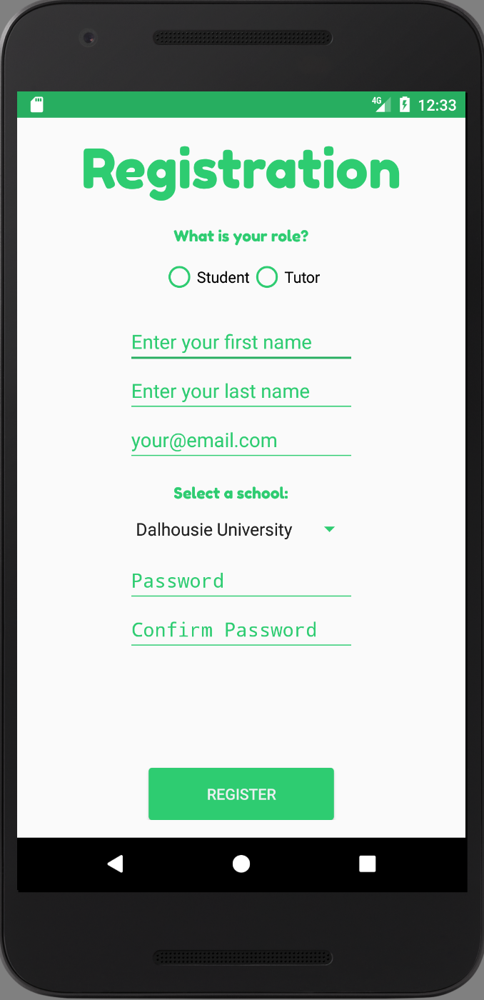

  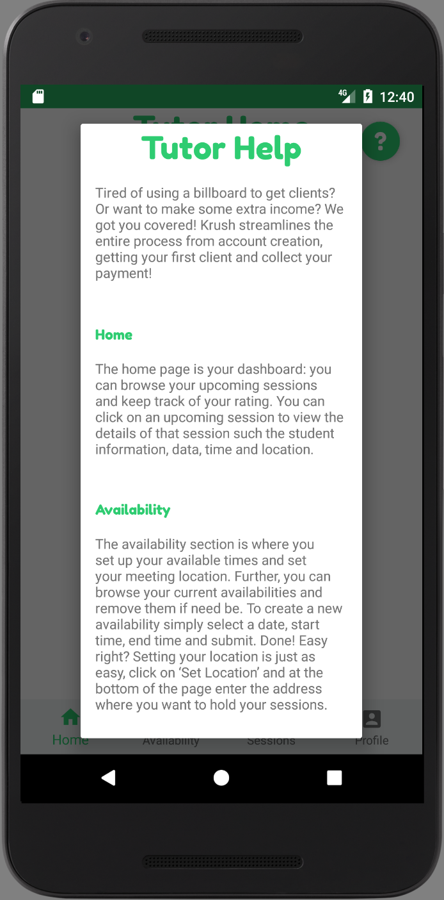

  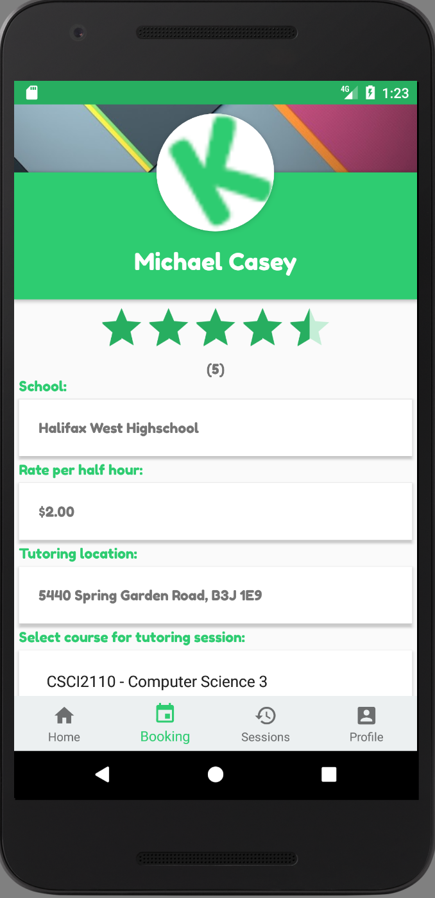

  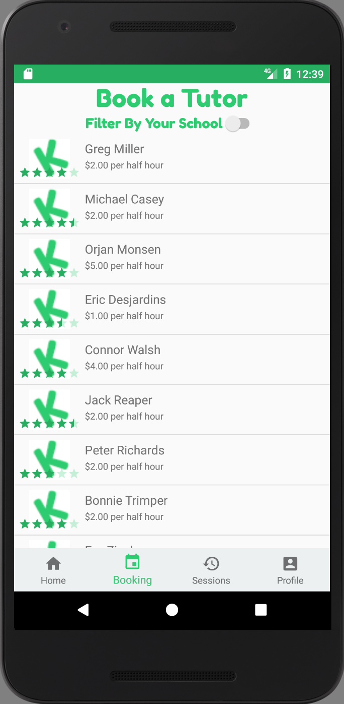

  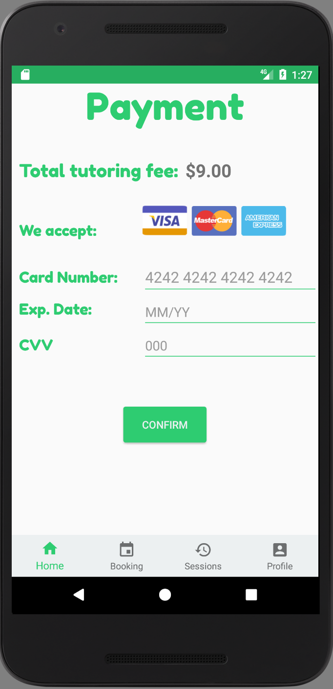

  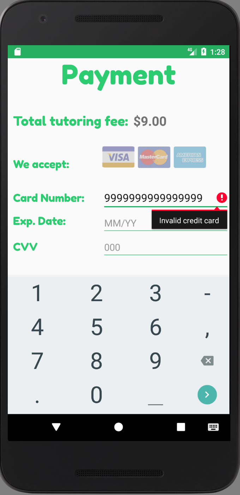

  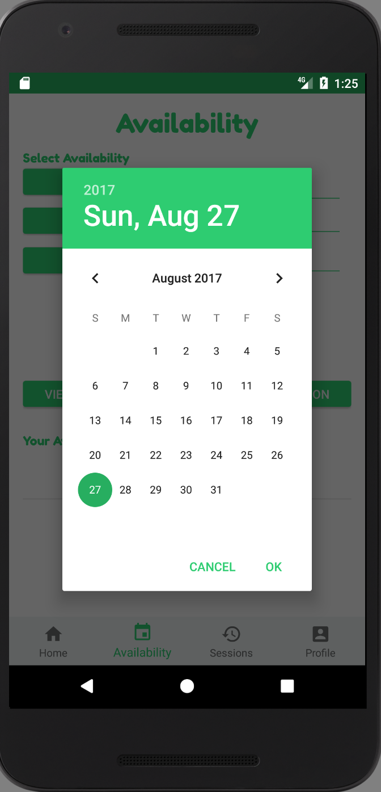

  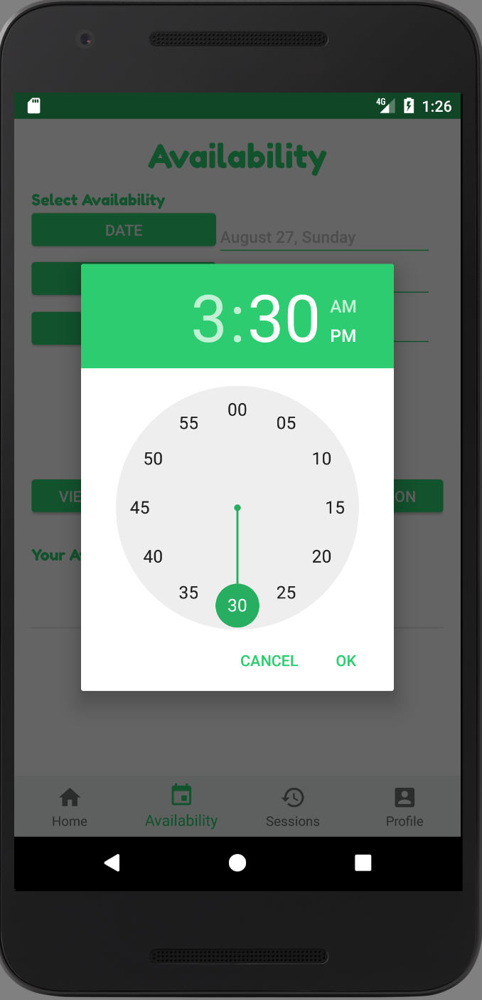

  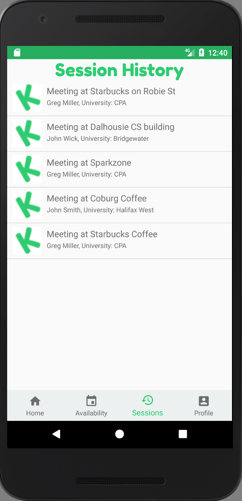

## Code Contribution Instructions

### Setup Development Environment
1. Clone this github repository: `git clone https://github.com/ericdesj/KRUSH.git`
2. Open this project in Android Studios
3. We are using sdk21, and sometimes Gradle will throw a few build errors when setting up the environment. If so, click on the `Sync repository, install dependencies` popup window in the IDE.

### Virtual Device Testing
To test the mobile application, you have to run the app on a phone VM which is using sdk21. Click on `create new virtual device`, select the phone you wish to run it on (e.g. Nexus 5), click next, select the `x86 images` tab, and select `Lollipop 21 x86-64 Android 5.0`. Click next and finish. 

### DB Migrations and Seeding
We are currently only running the DB seeders on the first time the application gets opened on the emulator (we don't want to run seeders on every application launch, as this would duplicate the data each time the app was tested).

### DB Reset
We currently don't have a way to reset the DB. However, if you wish to reset the DB and rerun the seeders, you should follow these steps:
1. Go to Tools --> Android --> AVD Manager
2. In the "Actions" column, click on the dropdown arrow button.
3. Click on `Wipe Data`. This will wipe all cached data on your emulator, including the pre-seeded data for KRUSH. 
4. Rerun the app on the emulator. You will now reseed the DB.

## 3rd Party References
- [1] Prolific Interactive, "Prolific Interactive material-calendarview," in GitHub, GitHub, 2016. [Online]. Available: https://github.com/prolificinteractive/material-calendarview. Accessed: Feb. 8, 2017.
- [2] M. Brandao, "Fredoka One," in Google fonts, Google. [Online]. Available: https://fonts.google.com/specimen/Fredoka+One?selection.family=Fredoka+One. Accessed: Mar. 4, 2017.
- [3] "How to get all possible combinations of a list’s elements?", Stackoverflow.com, 2017. [Online]. Available: http://stackoverflow.com/questions/464864/how-to-get-all-possible-combinations-of-a-list-s-elements. [Accessed: 08- Mar- 2017].
- [4] C. (n.d.). Codepath/android_guides. Retrieved March 12, 2017, from https://github.com/codepath/android_guides/wiki/Populating-a-ListView-with-a-CursorAdapter
- [5] List View. (n.d.). Retrieved March 12, 2017, from https://developer.android.com/guide/topics/ui/layout/listview.html
- [6] How to disable BottomNavigationView shift mode? (n.d.). Retrieved March 12, 2017, from http://stackoverflow.com/questions/40176244/how-to-disable-bottomnavigationview-shift-mode
- [7] Android column '_id' does not exist? (n.d.). Retrieved March 12, 2017, from http://stackoverflow.com/questions/3359414/android-column-id-does-not-exist
- [8]"CSSAuthor", Cssauthor.com, 2017. [Online]. Available: http://www.cssauthor.com/wp-content/uploads/2014/03/Credit-Card-Icons.jpg. Accessed: 18- Mar- 2017.
- [9]D. J, "android on Text Change Listener", Stackoverflow.com, 2017. [Online]. Available: http://stackoverflow.com/questions/20824634/android-on-text-change-listener. Accessed: 18- Mar- 2017.
- [10]"how to Search Address by Name on Google Map Android", Stackoverflow.com, 2017. [Online]. Available: http://stackoverflow.com/questions/17160508/how-to-search-address-by-name-on-google-map-android. [Accessed: 26- Mar- 2017].
# FlipTutor
